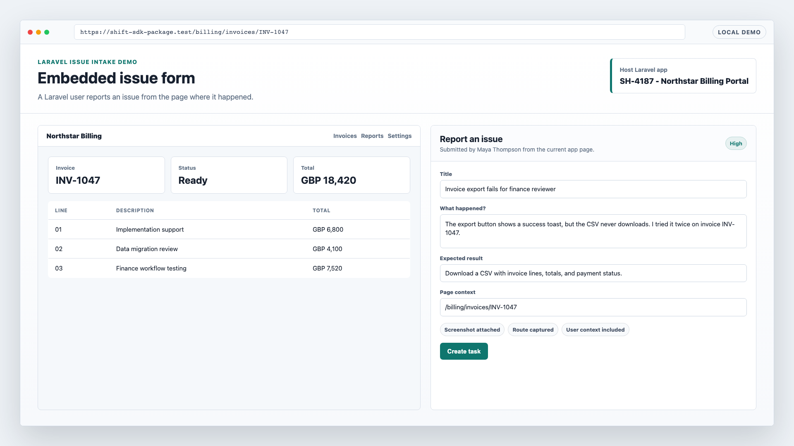
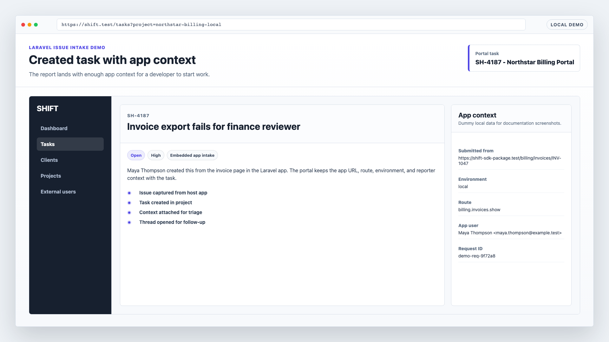
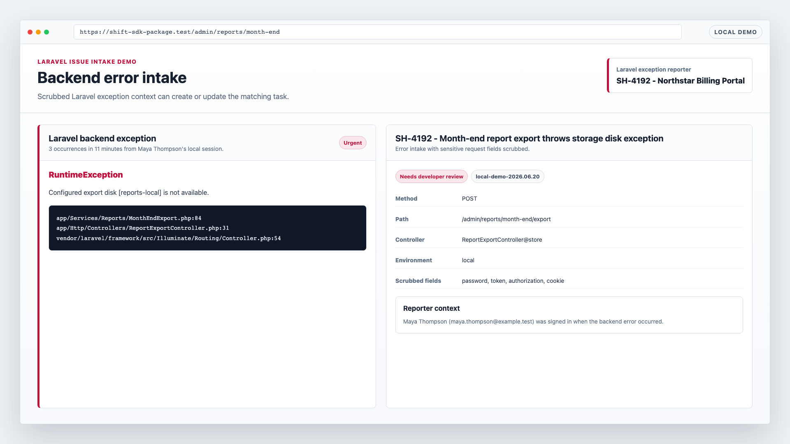
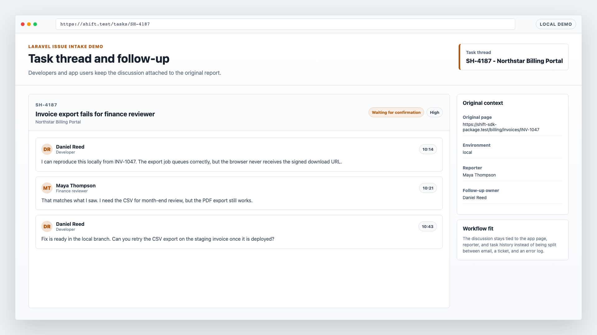

# Laravel App Issue Intake

SHIFT captures issue reports from the Laravel page where the problem happened.

Install `wyxos/shift-php` in a Laravel app, let signed-in users report an issue from the current page, and keep the task, request context, backend error details, and follow-up thread in one place.

The demo shows that report moving from the host app into a task thread with enough context for triage.

## Workflow Fit

- Email is flexible, but the app route, signed-in user, environment, and current page state usually need to be reconstructed later.
- Ticket systems are good intake queues, but they often sit outside the product surface and ask the reporter to translate app behavior into support language.
- GitHub issues are useful once work is developer-shaped, but many app users should not need repository access or issue-writing habits.
- Sentry is built for exception telemetry. Backend error occurrences can be attached to the same task conversation as user-submitted context and follow-up.

The report starts from the Laravel app page before it becomes a detached support thread.

## Install Path

```bash
composer require wyxos/shift-php
php artisan install:shift
```

The installer uses browser verification by default. It detects the local app URL and environment, asks a portal user to approve the install, writes the project credentials, registers the app environment, scaffolds a collaborator resolver when needed, and publishes the embedded dashboard assets.

Use the hosted portal URL:

```env
SHIFT_URL=https://shift.wyxos.com
```

Use a local or self-hosted portal URL for development or a private install:

```env
SHIFT_URL=https://shift.test
```

Local and private URLs are supported by the installer and package client. The active portal still needs to reach the app URL for collaborator lookup.

## Demo








