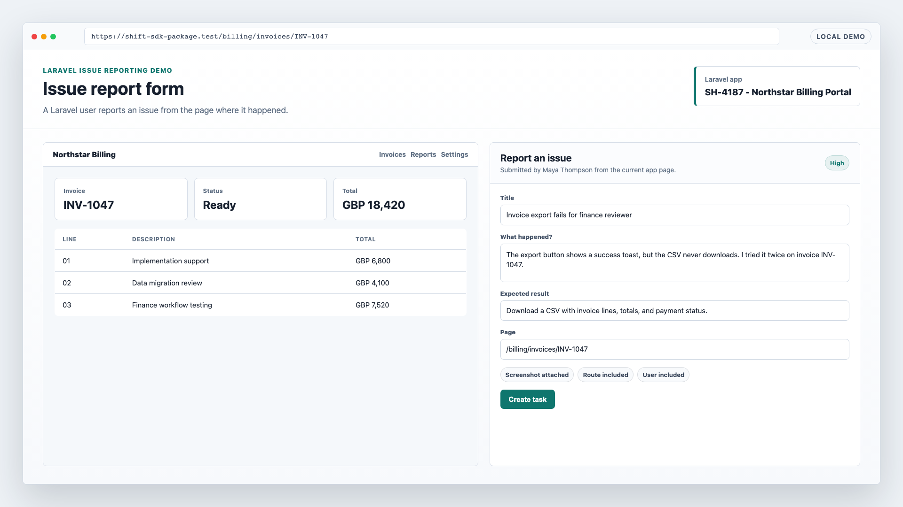
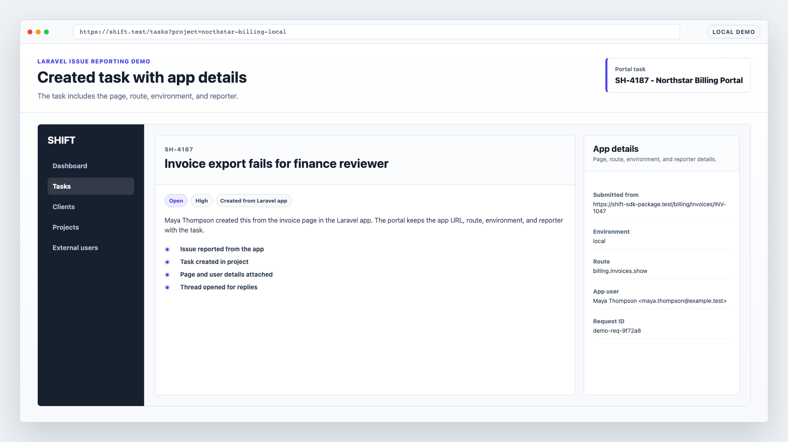
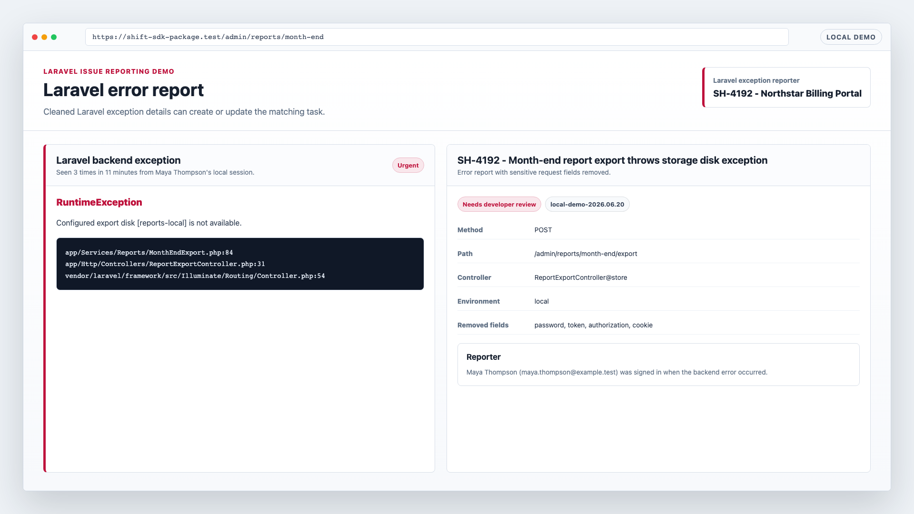
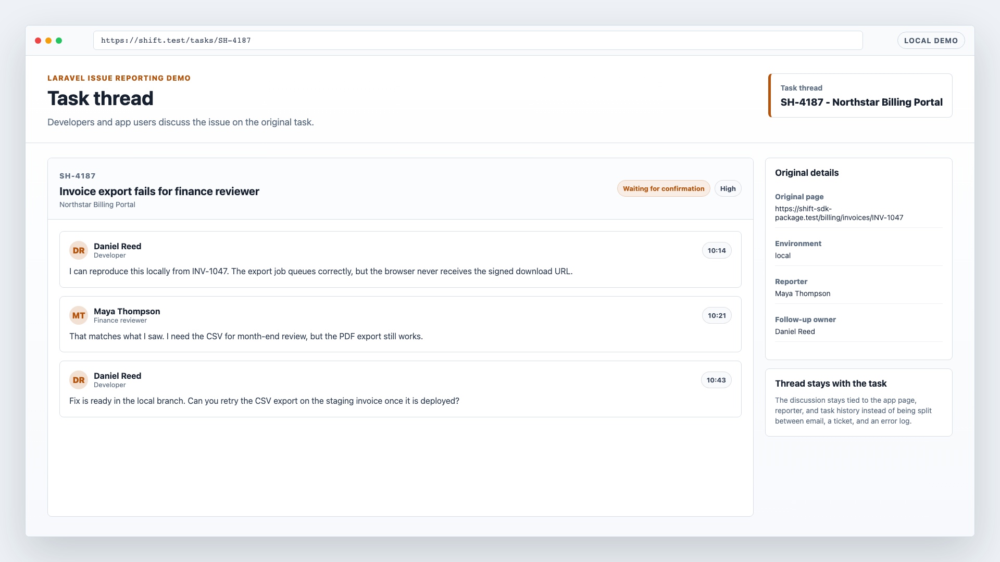

# Report Issues From a Laravel App

SHIFT lets users report an issue from the Laravel page where the problem happened.

Install `wyxos/shift-php` in a Laravel app, let signed-in users report an issue from the current page, and keep the task, page URL, route, request details, backend errors, and replies in one place.

The demo shows the report becoming a task with enough detail for a developer to start.

## Compared With Email And Tickets

- Email is flexible, but the app route, signed-in user, environment, and current page state usually need to be reconstructed later.
- Ticket systems can collect reports, but they often ask the reporter to describe app behavior outside the app.
- GitHub issues work once a report is clear enough for developers, but many app users should not need repository access or issue-writing habits.
- Sentry is built for exceptions. A Laravel error report can sit beside the user's task and replies.

The report starts on the Laravel page before it becomes a separate email thread or ticket.

## Install Path

```bash
composer require wyxos/shift-php
php artisan install:shift
```

The installer uses browser verification by default. It detects the local app URL and environment, asks a portal user to approve the install, writes the project credentials, registers the app URL, creates a collaborator resolver when needed, and publishes the dashboard assets.

Use the hosted portal URL:

```env
SHIFT_URL=https://shift.wyxos.com
```

Use a local or self-hosted portal URL for development or a private server:

```env
SHIFT_URL=https://shift.test
```

Local and private URLs are supported by the installer and package client. The selected portal still needs to reach the app URL for collaborator lookup.

## Demo








