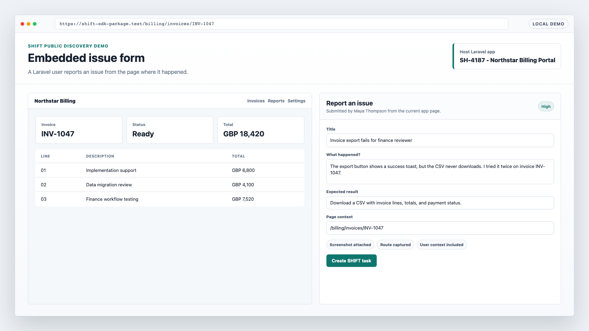
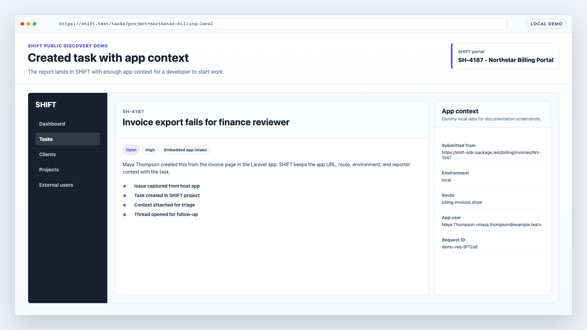
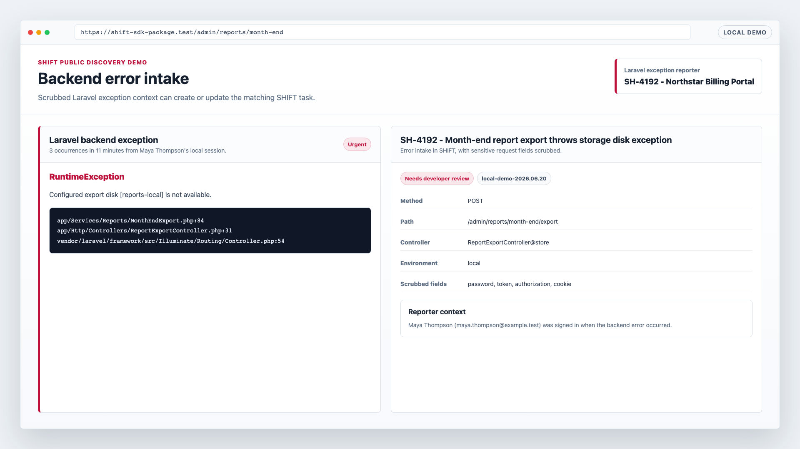
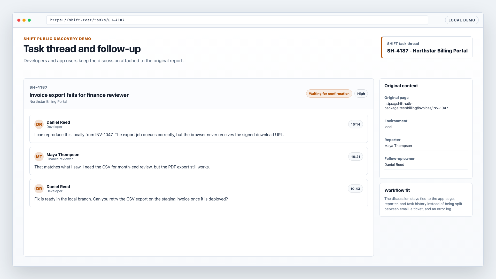

# SHIFT Public Discovery

SHIFT is Laravel app issue intake from inside the app.

The first public workflow is intentionally narrow: install `wyxos/shift-php` in a Laravel app, let users report issues where they happen, and keep the resulting task, request context, backend error details, and follow-up thread in SHIFT.

This is not a replacement pitch for Sentry, GitHub issues, email, or a helpdesk. Those tools can still be useful. SHIFT fits the gap where a Laravel app user can show what happened from the app surface, while a developer receives enough context to triage without rebuilding the report from screenshots and messages.

## Workflow Fit

- Email is flexible, but the app route, signed-in user, environment, and current page state usually need to be reconstructed later.
- Ticket systems are good intake queues, but they often sit outside the product surface and ask the reporter to translate app behavior into support language.
- GitHub issues are useful once work is developer-shaped, but many app users should not need repository access or issue-writing habits.
- Sentry is built for exception telemetry. SHIFT can attach scrubbed backend error occurrences to the task conversation, but it is also for user-submitted issue context and follow-up.

SHIFT starts from the Laravel app page, not after the report has already been separated from the app.

## Install Path

For a Laravel app:

```bash
composer require wyxos/shift-php
php artisan install:shift
```

The installer uses the SHIFT browser verification flow by default. It detects the local app URL and environment, asks a SHIFT user to approve the install in the browser, writes the project credentials, registers the app environment, scaffolds a collaborator resolver when needed, and publishes the embedded dashboard assets.

Use the hosted SHIFT URL for the hosted portal:

```env
SHIFT_URL=https://shift.wyxos.com
```

Use a local or self-hosted portal URL for local development or a private install:

```env
SHIFT_URL=https://shift.test
```

Local and private URLs are supported by the installer and package client. The active SHIFT instance still needs to reach the app URL for collaborator lookup.

## Demo Screenshots

The screenshots below are generated from local-only dummy fixture screens in this repository. They do not use production data, hosted SHIFT, Voidcare, real clients, real users, or production tokens.









## What The Demo Covers

- Embedded issue/task form in a Laravel app.
- Created SHIFT task with the originating app context attached.
- Backend error occurrence intake with scrubbed request and stack context.
- Task thread follow-up where the app user and developer discuss the same report.

## Regenerate Screenshots

Prerequisites:

- Run from `/Users/joeyj/Developer/wyxos/php/shift`.
- Composer and npm dependencies installed.
- The local SHIFT app available through Herd at `https://shift.test`.
- `APP_ENV=local` or the test environment. The fixture route returns `404` elsewhere.

Command:

```bash
npm run docs:screenshots
```

Optional arguments:

```bash
npm run docs:screenshots -- --base-url=https://shift.test/docs/public-discovery-demo
npm run docs:screenshots -- --output-dir=docs/assets/public-discovery
npm run docs:screenshots -- --headed
```

The script captures the four fixture URLs at a 1920x1080 viewport and checks each PNG's dimensions before reporting success.

## Local Fixture Boundary

The screenshot route is:

```text
/docs/public-discovery-demo/{screen}
```

It is available only in `local` and `testing`. It exists to keep public discovery assets repeatable without using hosted SHIFT or real customer data.

The fixture data is deliberately human-readable but fake: example names, `example.test` email addresses, local `.test` URLs, and invented task IDs.
